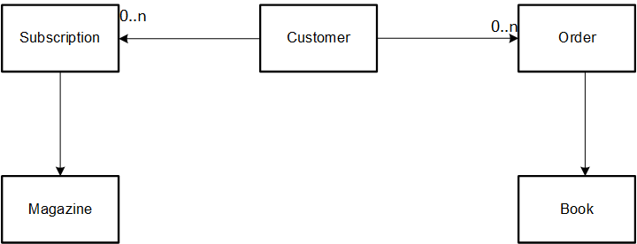
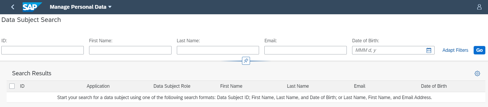
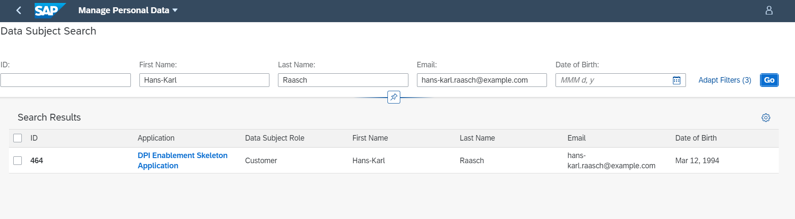
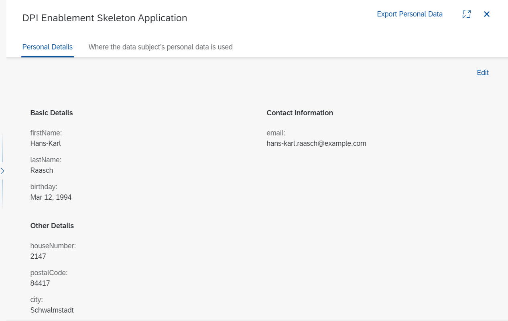
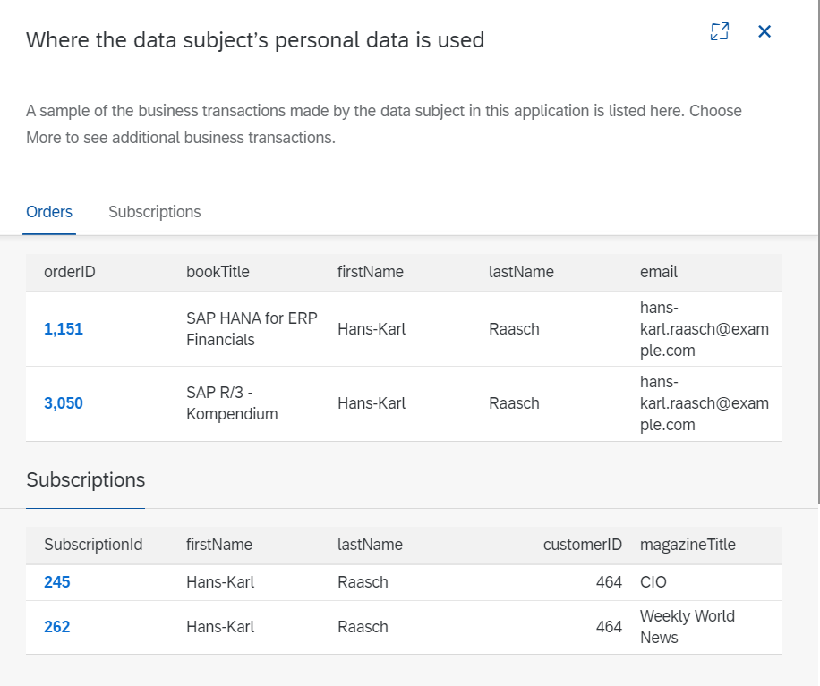
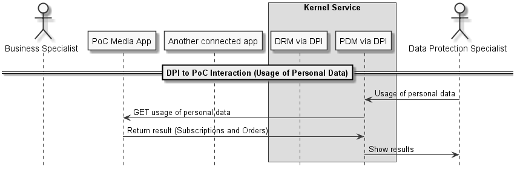

# Integrating CAP Applications with the Data Privacy Integration (DPI) Kernel Service
## Introduction

This guide provides an overview of how to integrate CAP applications with the [Data Privacy Integration kernel service][dpi] (DPI). DPI service is a kernel services that supports applications to be compliant with Data Protection and Privacy (DPP) regulations, like GDPR. DPI exposes the capabilities of the [Personal Data Manager][pdm](PDM), [Business Context Manager][bcm], [Data Retention Manager][drm](DRM), and the Cloud Consent Repository (CCR) reuse services:

- Information Retrieval: the Data privacy Integration service is integrated with the [Personal Data Manager][pdm] service to provide capabilities for identification of data subjects, information retrieval and export of personal data to exercise the right to information of data subjects, and capabilities to request deletion of personal data to exercise the data subject's right to be forgotten.
- Business Purpose Management: integrated with the [Business Context Manager][bcm] to support the management of DPP Purposes and Business Context for legitimate processing of personal data.
- Data Deletion: integrated with the [Data Retention Manager][drm] to support the management of retention and residence rules for personal data and to orchestrate blocking and deletion of personal data.
- Consent Management: integrated with the Cloud Consent Repository to enable management of consents. 

In this guide, we are more focused on the information retrieval capabilities of DPI. We will show how to seamlessly integrate CAP applications with DPI by using CAP annotations. CAP - the Cloud Application Programming framework - is a framework of languages, libraries and tools for building enterprise-grade services and applications. CAP allows developers to focus on their application domains, so that they do not have to worry about data privacy concerns. With CAP, an integration with the Data Privacy Integration (DPI) services can be achieved by annotating the domain model with CDS.

## Prerequisites
- An application developed with CAP, with entities representing data subjects and transactional data. In this guide, we provide a simple application that can be extended with CAP annotations.
- A quota for Data Privacy Integration kernel service. See [here][quota] on how to setup the DPI service and SAAS application.
- A development environment for CAP applications. See [here][get_started] for how to setup a local development environment. 

## The Sample Application
For our purpose, we make use of a [simple CAP application](https://github.wdf.sap.corp/D060763/Dpp-showcase-apps-cap).The domain model of the sample CAP application is shown below:



As shown above, a `Customer` can create `Subscriptons` to `Magazines` or place `Orders` to `Books`. In our domain, the `Customer` represents a data subject that is identified uniquely by an `ID` and the `Subscriptions` and `Orders` represent transactional data. 

The domain model in CDS is shown as below. See [here][schema] 

```javascript
entity Customers  {
    key ID : Integer;
    firstName : String;
    lastName :  String;
    email : String;
    phone : String;
    houseNumber : String;
    postalCode : String;
    city : String;
    country :  String;
    birthday: Date;
    orders : Association to many Orders on orders.customer = $self; 
    subscriptions : Association to many Subscriptions on subscriptions.customer = $self; 
}

entity Orders : managed {
    key ID : Integer;
    book: Association to one Books;
    customer : Association to one Customers;
}

entity Books : managed
{
    key ID : Integer;
    author : String;
    bookTitle : String;
}

entity Magazines
{
    key ID : Integer;
    magazineTitle: String;
    publishDate : Date;
}

entity Subscriptions : managed
{
    key ID : Integer;
    customer: Association to one Customers;
    startDate: Date;
    magazine : Association to one Magazines;

}
```

## Annotating Personal Data
In accordance with the recommended CAP principles, we add a new service to our application that handles all the DPP requirements. The entities have to be annotated and exposed via a service. Hence, we expose the DPP-relevant entities like `Customers`, `Orders`, and `Subsciptions` as a service as shown below:

```javascript
@path : '/dpp'
service DPPService {
    entity Customers as
        select from db.Customers {
            key ID,
                firstName,
                lastName,
                email,
                phone,
                houseNumber,
                postalCode,
                city,
                country,
                birthday
        };

    entity Orders    as
        select from db.Orders {
            key ID                 as orderID,
                book.bookTitle     as bookTitle,
                customer.firstName as firstName,
                customer.lastName  as lastName,
                customer.email     as email,
                customer.ID        as customerID
        };
    
    entity Subscriptions as
        select from db.Subscriptions
        {
            key ID as SubscriptionId,
            customer.firstName  as firstName,
            customer.lastName as lastName,
            customer.ID as customerID,
            magazine.magazineTitle as magazineTitle,
            startDate
         }
};

```

Next comes the annotation of the entities representing the data subject. The `Customer` is annotated with [PersonalData][personalDataVoc] and [Communication][CommunicationVoc] vocabularies. The PersonalData vocabularies provide the means for annotating the data subject, data subject identifier, and roles. The Communication vocabularies provide the means for annotating other search fields like the first name, last name, email address, and date of birth. This is shown below:

```javascript
annotate DPPService.Customers with @(Communication.Contact  : {  
    n : {
        surname: lastName, // annotating the lastName field as the surname
        given: firstName // annotating the firstName field as the given name
    },
    bday :  birthday, // annotating the birthday field
    email: email // annotating the email field
}) 

// annotating the Customers entity as a DataSubject and role as a Customer
@(PersonalData.EntitySemantics : 'DataSubject')  @(PersonalData.DataSubjectRole : 'Customer') {  

    ID          @PersonalData.FieldSemantics : 'DataSubjectID'; // annotating the ID field as the DataSubjectID
    firstName   @PersonalData.IsPotentiallyPersonal;
    lastName    @PersonalData.IsPotentiallyPersonal;
    email       @Communication.IsEmailAddress;
    phone       @Communication.IsPhoneNumber;
    houseNumber @PersonalData.IsPotentiallyPersonal;
    postalCode  @PersonalData.IsPotentiallyPersonal;
    city        @PersonalData.IsPotentiallyPersonal;
    country     @PersonalData.IsPotentiallyPersonal;
    birthday    @PersonalData.IsPotentiallyPersonal;
};
 
```
As shown above:
* To annotate an entity as a data subject, use `@(PersonalData.EntitySemantics : 'DataSubject')`
* To annotate an entity for a given data subject role, use `@(PersonalData.DataSubjectRole : 'Customer')`
* To annotate the data subject identity, the field or attribute is annotated with `@PersonalData.FieldSemantics : 'DataSubjectID'`
* To annotate potentially personal data fields, like address fields, use `@PersonalData.IsPotentiallyPersonal`
* To annotate contact fields like email, phone, use `@Communication.IsEmailAddress` and `@Communication.isPhoneNumber` respectively.
* For more information about the key annotation and meaning, please go to [the annotation documentation][vocabulary].

Finally comes the annotation of the transactional objects. The `Orders` and `Subscriptions` are annotated as `ContractRelated` entities. Other options are defined in the [Personal Data Vocabulary][personalDataVoc]. The data subject identifier is annotated with `@PersonalData.FieldSemantics : 'DataSubjectID'`. In addition, the fields of the transactional objects could be labelled as potentially personal using `@PersonalData.IsPotentiallyPersonal`.

```javascript
annotate DPPService.Orders with @(PersonalData.EntitySemantics : 'ContractRelated') {
    customerID @PersonalData.FieldSemantics : 'DataSubjectID';
    orderID @PersonalData.IsPotentiallyPersonal;
    firstName @PersonalData.IsPotentiallyPersonal;
    lastName @PersonalData.IsPotentiallyPersonal;
    email @PersonalData.IsPotentiallyPersonal;
    bookTitle;
};

annotate DPPService.Subscriptions with @(PersonalData.EntitySemantics : 'ContractRelated') {
    customerID @PersonalData.FieldSemantics : 'DataSubjectID';
    SubscriptionId @PersonalData.IsPotentiallyPersonal;
    firstName @PersonalData.IsPotentiallyPersonal;
    lastName @PersonalData.IsPotentiallyPersonal;
    email @PersonalData.IsPotentiallyPersonal;
    startDate;
    magazineTitle;
};
```

## DPI Instance configuration
Below is a sample DPI instance configuration JSON file showing the configuration details to enable the Information capabilities of the Data Privacy Integration service. See [here][instance-config].

```json
{
    "xs-security": {
        "xsappname": "dpi-enablement-inst",
        "authorities": [
            "$ACCEPT_GRANTED_AUTHORITIES"
        ]
    },
    "dppConfig": {
        "applicationName": "dpi-enablement-skeleton",
        "applicationHost":"https://capshowcaseapps-srv.cfapps.sap.hana.ondemand.com",
        "information": {
            "applicationTitle": "DPI Enablement Skeleton Application",
            "applicationTitleKey": "dpi-enablement-skeleton",
            "modules": [
                {
                    "fullyQualifiedModuleName": "dpp-showcase-app-cap",
                    "applicationURL": "https://capshowcaseapps-srv.cfapps.sap.hana.ondemand.com",
                    "endPoints": [
                        {
                            "type": "odataV4",
                            "serviceName": "service",
                            "serviceTitle": "service",
                            "serviceTitleKey": "service",
                            "serviceURI": "/dpp",
                            "hasGdprV4Annotations": true
                            
                        }
                    ]
                }
            ]
        }
    }
}
```

* The information configuration can contain several `modules`, each of which refer to an application and endpoints from which personal data information of data subjects can be retrieved.
* `applicationURL`: contains the base URL of the application
* `endpoints[n]/type`: is the type of application, which could be rest or odata.
* `endpoints[n]/serviceURI`: refers to the base path of the entities of the application. The DPI derives the entity interface by appending the applicationURL, serviceURI, and the entity's Name. Here the `applicationURL`, the `fullyQualifiedModuleName` and the `serviceURI` have to be those of your CF deployment and your CAP service definition.
* `endpoints[n]/serviceName`: provide name for the OData or RESTful service that provides the personal data stored in an application. This identifies each service in the current application.
* `endpoints[n]/serviceTitle`: Provide the name of the OData or RESTful service that will be displayed on the UI. This title will be displayed if the application does not provide a text bundle key for a language-specific service title.
* `endpoints[n]/serviceTitleKey`: Provide a text bundle key that will be used to select the language-specific service title to be displayed on the UI.
* `endpoints[n]/hasGdprV4Annotations`: boolean value for GDPR version 4 annotations. 

Further explanations and other fields are available at [PDM Configuration Properties][configurationFields].

To create a new instance of the DPI service using the configuration file, execute:

```cmd
$ cf create-service "data-privacy-integration-service" "application" “service instance name” -c “Stringified json or path to a json file” 
```

## How to Run the Sample Application
To run the integration of the sample application with PDM, build the CAP application and deploy to SAP Cloud Platform. For example, we use the commands in the [exec.ps1][script] script. Note that the script should be adopted for your particular usecase. 

<!-- * 2. show screenshots of the PDM page (after the text below)

link to explanation of the configuration fields: https://help.sap.com/viewer/b20c77c1f1fc44b896f6f66719fc603a/SHIP/en-US/4ee5705b8ded43e68bde610223722971.html#550e5d723c0b4d6a94e72b1714e02abf.html -->

## Searching for Personal Data from DPI SaaS Application
After a successfull deployment of the application and instantiation of the Data Privacy Integration service, the necessary quota and roles should be assigned as described in the prerequisite session and in [the DPI developers guide][quota]. A data subject search can be done from the DPI SaaS application as shown below:



The Data Protection specialist can enter a search query by using for example using the data subject id or a combination of "First Name", "Last Name", "Date of Birth", and "Email" as shown in the query below:



The Data Protection Specialist can see the following result on the Personal Details page:


The corresponding transactional data looks like the following.



## How Information Retrieval Happens
Suppose a Data Protection Specialist wants to retrieve the information of a particular customer and determine where the personal data of the customer is being used. The sequence diagram below illustrates how this happens:



The Data Protection specialist enters a search query via the DPI SaaS Application. In the background, the DPI calls the application's OData APIs to search for personal data, both from master data and transactional data. The results are aggregated by DPI and displayed as shown in the pictures of the results in the previous sections. 

## References
* CAP Cookbook: https://cap.cloud.sap/docs/
* Integrating REST applications with DPI: https://github.wdf.sap.corp/DPP-showcase-application/DPI-Enablement
* DPI Developer guide: https://github.wdf.sap.corp/pages/Data-Privacy-Engineering-Services/services/developers/dev-dpi.html 
* Personal Data Manager: https://help.sap.com/viewer/product/PERSONAL_DATA_MANAGER/SHIP/en-US


[dpi]: https://github.wdf.sap.corp/pages/Data-Privacy-Engineering-Services/services/dpi.html
[pdm]: https://help.sap.com/viewer/product/PERSONAL_DATA_MANAGER/SHIP/en-US
[drm]: https://help.sap.com/viewer/product/DATA_RETENTION_MANAGER/SHIP/en-US
[bcm]: https://wiki.wdf.sap.corp/wiki/display/PDM/Business+Context+Manager
[personalDataVoc]: https://github.com/SAP/odata-vocabularies/blob/master/vocabularies/PersonalData.md
[communicationVoc]: https://github.com/SAP/odata-vocabularies/blob/master/vocabularies/Communication.md
[configurationFields]: https://help.sap.com/viewer/b20c77c1f1fc44b896f6f66719fc603a/SHIP/en-US/4ee5705b8ded43e68bde610223722971.html#550e5d723c0b4d6a94e72b1714e02abf.html 
[vocabulary]: https://cap.cloud.sap/docs/advanced/odata#sap-vocabularies
[schema]: https://github.wdf.sap.corp/D060763/Dpp-showcase-apps-cap/blob/master/db/schema.cds
[instance-config]: https://github.wdf.sap.corp/D060763/Dpp-showcase-apps-cap/blob/master/instance-config.json
[script]:https://github.wdf.sap.corp/D060763/Dpp-showcase-apps-cap/blob/master/exec.ps1
[quota]: https://github.wdf.sap.corp/pages/Data-Privacy-Engineering-Services/services/developers/dev-dpi.html 
[get_started]:https://cap.cloud.sap/docs/get-started/
