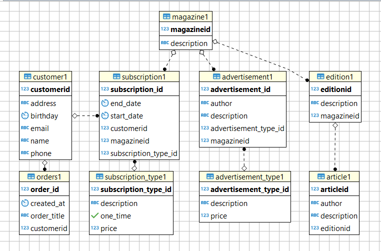

# Media Application : The software is built for newspaper and magazine publisher (Print or Web form).

[URL to access application on Cloud Foundry](https://sap-icf-approuter-media.cfapps.sap.hana.ondemand.com/res/index.html)
[Main Wiki](https://wiki.wdf.sap.corp/wiki/display/appsec/DPP+internal+Showcase+application+on+Cloud+Foundry+using+Spring+Boot)


###Used Services:
P  - Postgres. More details: [Configure Persistence](https://github.wdf.sap.corp/cc-java-dev/cc-coursematerial/blob/master/ConnectDatabase/Exercise_8_Part1_ConfigurePersistence.md)
  - Audit log. More details:[audit-java-client](https://github.wdf.sap.corp/xs-audit-log/audit-java-client)
  - Application Log. More details: [Logging Support for Cloud Foundry](https://github.com/SAP/cf-java-logging-support) 
  - The User Account and Authentication (UAA). More details: [Security - Detail Notes](https://github.wdf.sap.corp/cc-java-dev/cc-coursematerial/tree/master/Security) 
  - Relationships with entities is as follows
  
  
###Custom Annotation Personal Data:
```
public @interface PersonalData {    
    public enum PersInfoType {
		PII,//Identifiable 
		SPI,//Sensitive
		RPI //Related
	}
	public enum LogType {
		Read, //Read Access Log 
		Change//Change Log 
	}
	public enum MaskMode {
		On,  
		Off 
	}
}
```
4. Local test application router with Postman (More details here: [Exercise 24: Make your Application Secure](https://github.wdf.sap.corp/cc-java-dev/cc-coursematerial/blob/master/Security/Exercise_24_MakeYourApplicationSecure.md)) 

- Call your service endpoints e.g. `https://media-app.cfapps.sap.hana.ondemand.com/customers/` manually using the `Postman` Chrome plugin. You should get for any endpoint an `401` ("unauthorized") status code. 
- On Cloud Foundry it is not possible to provide a valid JWT token which is accepted by the XSUAA. Therefore if you like to provoke a `403` ("forbidden", "insufficient_scope") status code **you need to call your application via the `approuter`** e.g. `https://i045157trial-approuter-i045157.cfapps.sap.hana.ondemand.com/index.html` in order to authenticate yourself and to create a JWT Token with no scopes. **BUT** you probably will get as response the login screen in HTML. That's why you need to
  - enable within `Postman` the `Interceptor`.  You might need to install another [`Postman Interceptor` Chrome Plugin](https://chrome.google.com/webstore/detail/postman-interceptor/aicmkgpgakddgnaphhhpliifpcfhicfo), which will help you to send requests which use browser cookies through the `Postman` app. 
  - logon via `Chrome` Browser first and then
  - back in `Postman` resend the request e.g. `https://i045157trial-approuter-i045157.cfapps.sap.hana.ondemand.com/index.html` and
  - make sure that you now get a `403` status code.

> **Note:**  
> By default the application router enables **CSRF protection** for any state-changing HTTP method. That means that you need to provide a `x-csrf-token: <token>` header for state-changing requests. You can obtain the `<token>` via a `GET` request with a `x-csrf-token: fetch` header to the application router.


#### Read :
> HTTP Method: GET, URL: /customer/{id}   
HTTP Method: GET, URL: /customers

#### Update :
> HTTP Method: PUT, URL: /customer/{id}
Hint:- Pass the content-type header as key value pair => content-type:application:json and following json object as raw in the body of your request. Note customer_ID is autogenerated.

```
{
"name": "Lionel Messi",
"email": "lionel.messi@some.com",
"phone": " "Argentina Updated",
"birthday" : "1987-02-12"
}
```
#### Delete :
> HTTP Method: DELETE, URL: /customer/{id}+91 34324",
"address":

###### Entity 2 => SubscriptionType with following endpoints
> GET, /subscriptionTypes  
GET, /subscriptionType/{id}  
POST, /subscriptionType  
PUT, /subscriptionType/{id}  
DELETE, /subscriptionType/{id}  


###### Entity 3 => Subscription with following endpoints
> HINT:- All the CRUD operations for subscription are wrt to a particular customer.  
GET, / /customer/{custId}/subscriptions => Gives all subscriptions the customer is subscribed to.  
GET, /customer/{custId}/subscriptions/{id}  
POST, /customer/{custId}/subscriptions/{subscriptionTypeId}  
PUT, /customer/{custId}/subscriptions/{subscriptionId}/{subscriptionTypeId}  
DELETE, /customer/{custId}/subscriptions/{id}  


## Login to `Kibana`
Finally we want to analyze the logs generated by (your) application in `Kibana`.

- Go to Kibana: [https://logs.cf.sap.hana.ondemand.com](https://logs.cf.sap.hana.ondemand.com) and login with your CF user, i.e. usually your domain user and GLOBAL domain password.
- The landing page of `Kibana` is the `Dashboard` page providing some other dashboards like Usage, Perfomance, Network load and others. 
- At the top right you can adapt the timelines to your need and enable "Auto-refresh". The default is that log messages of the last 15 minutes are shown.
- On the `Visualize` page you may create and share your own dashboards. Creating dashboards is not part of this exercise.
